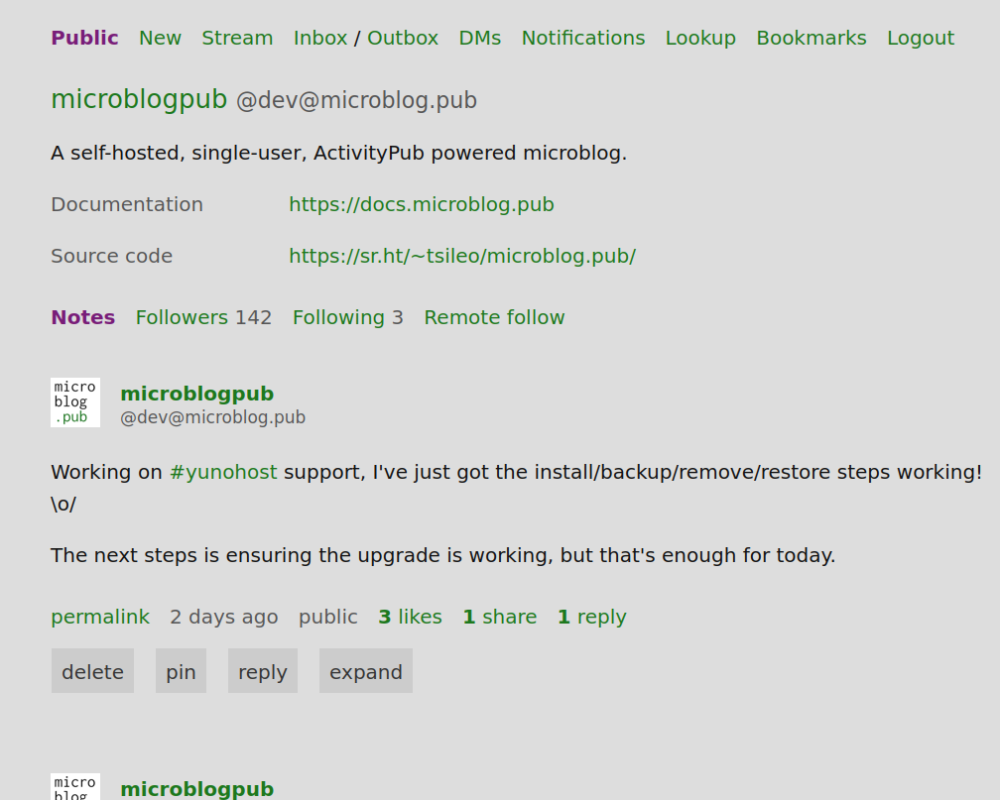

<!--
N.B.: This README was automatically generated by <https://github.com/YunoHost/apps/tree/master/tools/readme_generator>
It shall NOT be edited by hand.
-->

# microblog.pub for YunoHost

[](https://dash.yunohost.org/appci/app/microblogpub)  

[](https://install-app.yunohost.org/?app=microblogpub)

*[Read this README in other languages.](./ALL_README.md)*

> *This package allows you to install microblog.pub quickly and simply on a YunoHost server.*  
> *If you don't have YunoHost, please consult [the guide](https://yunohost.org/install) to learn how to install it.*

## Overview

A self-hosted, single-user, ActivityPub powered microblog.

not read for use


**Shipped version:** 2.0.0~ynh2

**Demo:** <https://microblog.pub>

## Screenshots



## Documentation and resources

- Official app website: <https://docs.microblog.pub>
- Official user documentation: <https://docs.migroblog.pub>
- Upstream app code repository: <https://git.sr.ht/~tsileo/microblog.pub>
- YunoHost Store: <https://apps.yunohost.org/app/microblogpub>
- Report a bug: <https://github.com/YunoHost-Apps/microblogpub_ynh/issues>

## Developer info

Please send your pull request to the [`testing` branch](https://github.com/YunoHost-Apps/microblogpub_ynh/tree/testing).

To try the `testing` branch, please proceed like that:

```bash
sudo yunohost app install https://github.com/YunoHost-Apps/microblogpub_ynh/tree/testing --debug
or
sudo yunohost app upgrade microblogpub -u https://github.com/YunoHost-Apps/microblogpub_ynh/tree/testing --debug
```

**More info regarding app packaging:** <https://yunohost.org/packaging_apps>
